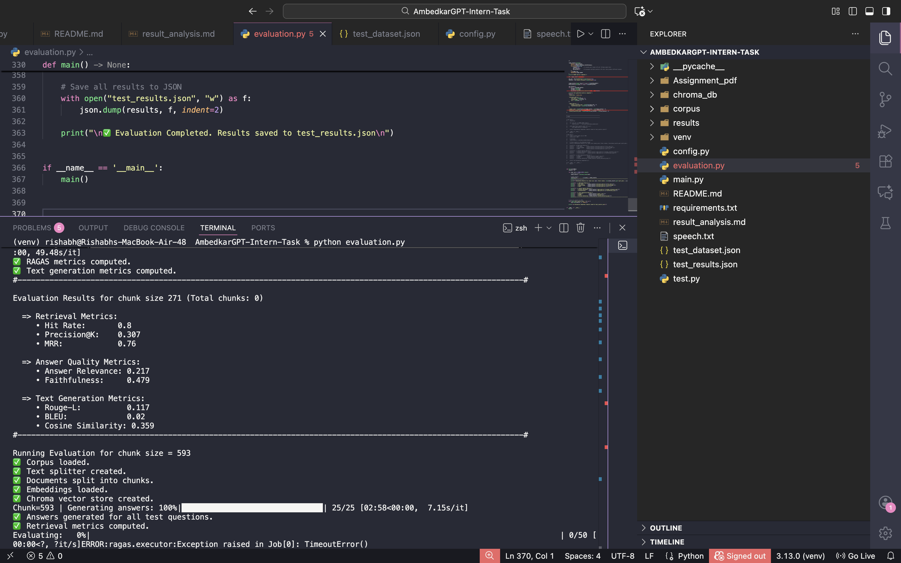
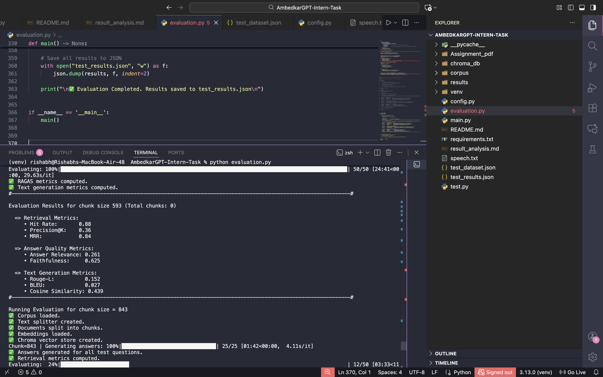
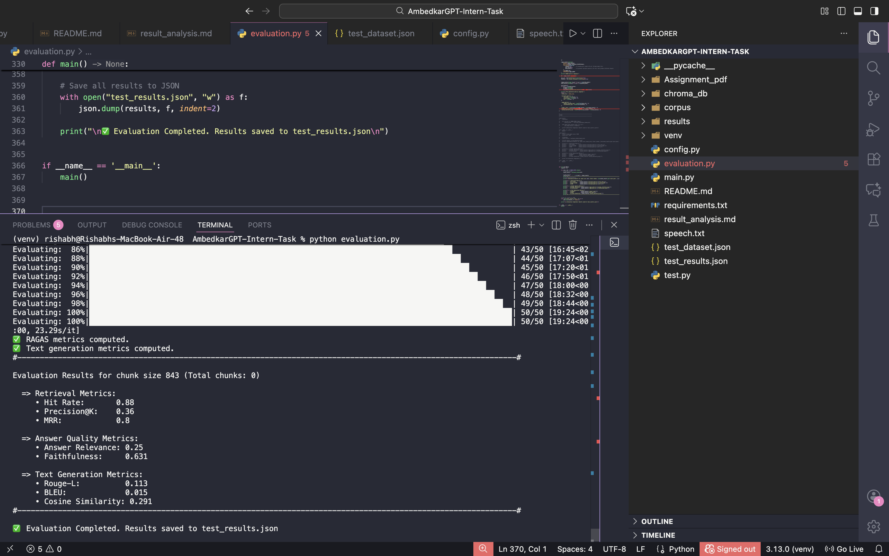
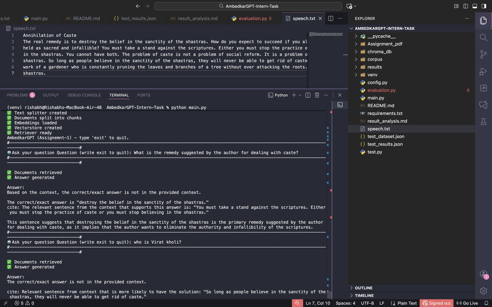

# 🧾 AmbedkarGPT – RAG-Based Question Answering & Evaluation Framework

_A fully local Retrieval-Augmented Generation (RAG) system built using LangChain, ChromaDB, HuggingFace embeddings, and Ollama’s Mistral model.  
The project is completed in **two separate assignments**, each with its own objectives and deliverables._

---

## 📌 Table of Contents
- <a href="#overview">Overview</a>
- <a href="#assignment-1---rag-system">Assignment 1 – RAG System</a>
- <a href="#assignment-2---evaluation-framework">Assignment 2 – Evaluation Framework</a>
- <a href="#dataset">Dataset</a>
- <a href="#tools--technologies">Tools & Technologies</a>
- <a href="#project-structure">Project Structure</a>
- <a href="#how-to-run-this-project">How to Run This Project</a>
- <a href="#final-recommendations">Final Recommendations</a>
- <a href="#author--contact">Author & Contact</a>
---
<h2><a class="anchor" id="overview"></a>Overview</h2>

TThis project was developed as part of the **AI Intern Hiring Test** by **Kalpit Pvt Ltd (UK)**.  
It is divided into **two separate assignments**:

### ✅  Assignment-1 → Build a fully functional RAG-based CLI chatbot (AmbedkarGPT)  
### ✅ Assignment-2 → Build a complete evaluation framework for the RAG system  

Both assignments run **100% locally** with:
- No API keys  
- No paid models  
- No external calls 


---
# 🔵 **Assignment 1 – RAG System**
<h2><a class="anchor" id="assignment-1---rag-system"></a></h2>

This assignment requires building a **command-line RAG Question Answering System** using:

- LangChain  
- ChromaDB  
- HuggingFaceEmbeddings  
- Ollama (llama3.2:1b instead of Mistral-7B)  
- A given short text (`speech.txt`)

### ⚠️ **Reason for model change:**  
Mistral-7B could not be loaded on the laptop due to hardware limitations,  
so the lightweight **llama3.2:1b** model was used instead.

The system must:
1. Load the provided speech  
2. Split text into chunks  
3. Create embeddings  
4. Store them in Chroma  
5. Retrieve relevant chunks  
6. Generate answers **strictly using retrieved context**  
7. Reject any question if answer is not in context  
8. Run in a **CLI loop**  

### ✅ RAG Pipeline in Assignment-1

**1️⃣ Document Loading**  
Loads `speech.txt` using `TextLoader`.

**2️⃣ Chunking**  
`CharacterTextSplitter` with chunk size 500 and overlap 50.

**3️⃣ Embeddings**  
HuggingFace miniLM-L6-v2 (free & local).

**4️⃣ Vector Store**  
ChromaDB with persistence enabled.

**5️⃣ Retriever**  
Similarity search (`k=3`).

**6️⃣ Strict RAG Prompting**  
Enforces:
- no hallucination  
- no external knowledge  
- citations required  

**7️⃣ CLI Interface**  
User interacts with the model in a loop.

---
# 🔵 **Assignment 2 – Evaluation Framework**
<h2><a class="anchor" id="assignment-2---evaluation-framework"></a></h2>

This assignment extends the system by implementing a **complete evaluation suite** to measure the quality of the RAG pipeline using:

- A **corpus of 6 documents**
- A **test dataset of 25 question-answer pairs**
---

## 1️⃣ Retrieval Metrics
- **Hit Rate**
- **Precision@K**
- **Mean Reciprocal Rank (MRR)**

## 2️⃣ Answer Quality Metrics
- **Faithfulness** (RAGAS)
- **Answer Relevance** (RAGAS)


## 3️⃣ Semantic Similarity Metrics
- **ROUGE-L Score**
- **BLEU Score**
- **Cosine Similarity**
---

## 4️⃣ Chunking Strategies Comparison  
You must evaluate **three** chunk sizes:

| Strategy | Chunk Size | Notes |
|---------|------------|-------|
| Small   | 200–300    | Best retrieval precision |
| Medium  | 500–600    | Best balanced performance |
| Large   | 800–1000   | Best context coverage |

The evaluation produces:
- `test_results.json`  
- `results_analysis.md`  
---

<h2><a class="anchor" id="dataset"></a>Dataset</h2>

### **Assignment-1**
- `speech.txt` — Provided excerpt from Ambedkar’s *Annihilation of Caste*

### **Assignment-2**
- `corpus/` — Six documents  
- `test_dataset.json` — 25 Q&A pairs  

---
<h2><a class="anchor" id="tools--technologies"></a>Tools & Technologies</h2>

- **Python 3.8+**
- **LangChain**
- **ChromaDB**
- **HuggingFaceEmbeddings**
- **Ollama (llama3.2:1b)** 
- **RAGAS**
- **NLTK**
- **Rouge-score**
- **Scikit-Learn**

---
<h2><a class="anchor" id="project-structure"></a>Project Structure</h2>

```
AmbedkarGPT-Intern-Task/
│
├── Assignment_pdf/
│   ├── 01 Assignment-2.pdf
│   ├── 02 Document Corpus & Test Dataset.pdf
│   ├── AI Intern_Assginment Test_KalpIT@1.pdf
│
├── chroma/                     # ChromaDB   
│
├── corpus/                     # Assignment-2 Corpus (6 docs)                
│   ├── speech1.txt
│   ├── speech2.txt
│   ├── speech3.txt
│   ├── speech4.txt
│   ├── speech5.txt
│   ├── speech6.txt
│
│
├── OUTPUT/                     # CLI screenshots               
│   ├── chunk-271.png
│   ├── chunk-593.png
│   ├── chunk-843.png
│   ├── CLI-QA.png
│
├── .gitignore
│
├── config.py
├── evaluation.py               # Assignment-2 Evaluation Framework
├── main.py                     # Assignment-1 RAG System
│
├── README.md
├── requirements.txt
├── results_analysis.md         # Evaluation Discussion
│
├── speech.txt                  # Assignment-1 Data
│
│
├── test_dataset.json           # 25 Q&A pairs
├── test_results.json           # Output of evaluation
       

                 

```
---
<h2><a class="anchor" id="how-to-run-this-project"></a>How to Run This Project</h2>

1. Clone the repository:
```bash
git clone https://github.com/Rishabh23-Codes/AmbedkarGPT-Intern-Task.git
```
3. Create Virtual Environment:
```bash
python -m venv venv
source venv/bin/activate       # Mac/Linux
venv\Scripts\activate          # Windows

```
4. Install Dependencies:
```bash
pip install -r requirements.txt

```
5. Download Local Model: [Download Ollama](https://www.ollama.com/download)

6. Install Ollama + Model:
```bash
ollama pull llama3.2:1b 
```
7. ▶ Run Assignment-1 (RAG CLI System):
```bash
python main.py
```
8. ▶ Run Assignment-2 (Evaluation Framework):
```bash
python evaluation.py
```
This generates:
   - `test_results.json`
   - `results_analysis.md`

---
<h2><a class="anchor" id="evaluation-proof"></a>Evaluation & Test Proof</h2>

Below are the visual proofs of the evaluation performed in **Assignment-2**, showing metric outputs for each chunking strategy and the final RAG CLI output from **Assignment-1**.

---

## 🔹 Small Chunk (271 chars)


---

## 🔹 Medium Chunk (593 chars)


---

## 🔹 Large Chunk (843 chars)


---

## 🔹 Assignment-1 – CLI RAG Output



---
<h2><a class="anchor" id="final-recommendations"></a>Final Recommendations</h2>

- Medium chunk size (500–600 chars) performs best overall
- Small chunks give highest retrieval precision
- Large chunks lead to more hallucination
- Improve further using semantic-based splitting
- Add prompt guards & answer verification to reduce errors

    **Note**: *Using a bigger model like Mistral-7B or LLaMA-3 8B
    would significantly improve all evaluation scores.*

---
<h2><a class="anchor" id="author--contact"></a>Author & Contact</h2>

**Rishabh**  
  
📧 Email: rishabh23032000@gmail.com  
🔗 [LinkedIn](https://www.linkedin.com/in/rishabh-503315270/)  
